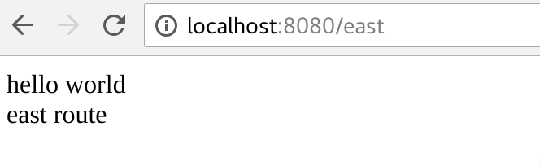
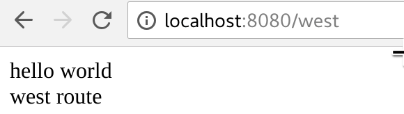
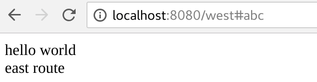

This is a reproduction of https://github.com/slamdata/purescript-routing/issues/60

Run

```
bower install
yarn install
pulp build
yarn start
```

Visit `http://localhost:8080/east` and `http://localhost:8080/west` to see it work.

What I want is `http://localhost:8080/west#abc` will render `RegionRoute West` as well.


### These are good





### This is not what I want


